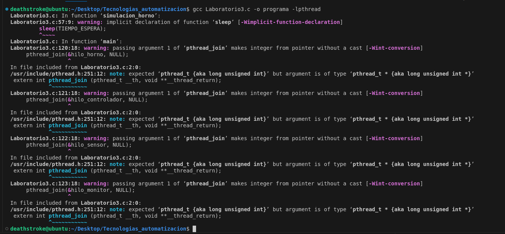
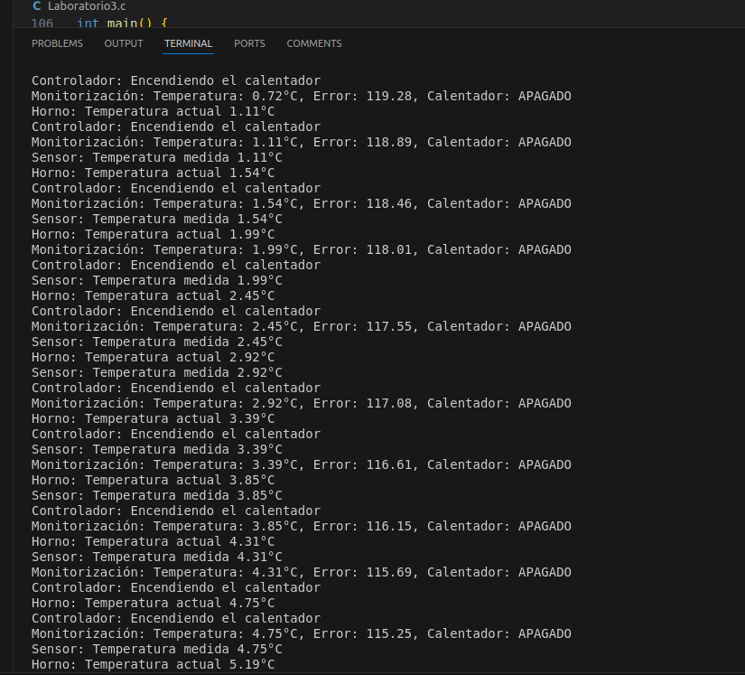

# Tecnologías de Automatización - Informe de Laboratorio 2
---
### Integrantes
- Rodrigo Willians Agurto Tumialan `20202021`
- Manuel Alejandro Pallete Figueroa `20191217`
---

```c
#include <stdio.h>
#include <pthread.h>
#include <math.h>

#define SET_POINT 120.0
#define MARGEN_ERROR 1.0
#define TIEMPO_ESPERA 1 // 1 segundo de espera entre iteraciones
#define MAX_ENTRIES 100

struct {
    double temperatura;
    double error;
    int estado_calentador;
} Registro;

// Variables globales compartidas
double temperatura_actual = 20.0; // Inicialmente la temperatura es baja

// Estado del calentador 
// 0: apagado
// 1: encendido)
int calentador_encendido = 0;     
float v_out_Controlador = 0;
pthread_mutex_t mutex_temperatura;

// Variables globales para el registro
int indice_registro = 0;
struct {
    double temperatura;
    double error;
    int estado_calentador;
} registros[MAX_ENTRIES];

float planta (float Rk){
    static float Rk_1=0,Rk_2=0,Rk_3=0;
    static float Ck_1=0,Ck_2=0,Ck_3=0;
    float Ck=0;
    Ck=2.016*Ck_1 - 1.262*Ck_2 + 0.2411*Ck_3 + 0.001108*Rk_1 + 0.003157*Rk_2 + 0.0005445*Rk_3;
    Rk_3 = Rk_2; //se actualiza el mas pasado
    Rk_2 = Rk_1; 
    Rk_1 = Rk;
    Ck_3 = Ck_2; //se actualiza el mas pasado
    Ck_2 = Ck_1; 
    Ck_1 = Ck;
    return Ck; //retorna la salida del proceso en un instante
}

// Función para simular la respuesta térmica del horno
void *simulacion_horno(void *arg) {
    while (1) {
        pthread_mutex_lock(&mutex_temperatura);
        float v_in = v_out_Controlador;
        double temperatura_objetivo = planta(v_in);
        temperatura_actual = temperatura_objetivo;
        printf("Horno: Temperatura actual %.2f°C\n", temperatura_actual);
        pthread_mutex_unlock(&mutex_temperatura);
        sleep(TIEMPO_ESPERA);
    }
}

// Función del controlador ON/OFF
void *controlador_on_off(void *arg) {
    while (1) {
        pthread_mutex_lock(&mutex_temperatura);
        if (temperatura_actual < SET_POINT - MARGEN_ERROR) {
            printf("Controlador: Encendiendo el calentador\n");
            v_out_Controlador = 24.0; // Voltaje de encendido
        } else if (temperatura_actual > SET_POINT + MARGEN_ERROR) {
            v_out_Controlador = 0; // Voltaje de apagado
            printf("Controlador: Apagando el calentador\n");
        }
        pthread_mutex_unlock(&mutex_temperatura);
        sleep(TIEMPO_ESPERA);
    }
}

// Función que simula el sensor de temperatura
void *sensor_temperatura(void *arg) {
    while (1) {
        // Simula la lectura de la temperatura
        //mutex_lock Bloquea el mutex para acceder a la variable global temperatura_actual
        pthread_mutex_lock(&mutex_temperatura);
        printf("Sensor: Temperatura medida %.2f°C\n", temperatura_actual);
        pthread_mutex_unlock(&mutex_temperatura);
        sleep(TIEMPO_ESPERA);
    }
}

// Función para monitorizar la evolución de la temperatura
void *monitorizacion(void *arg) {
    while (1) {
        pthread_mutex_lock(&mutex_temperatura);
        double delta = SET_POINT - temperatura_actual;
        if (indice_registro < MAX_ENTRIES) {
            registros[indice_registro].temperatura = temperatura_actual;
            registros[indice_registro].error = delta;
            registros[indice_registro].estado_calentador = calentador_encendido;
            indice_registro++;
        }
        printf("Monitorización: Temperatura: %.2f°C, Error: %.2f, Calentador: %s\n", temperatura_actual, delta, calentador_encendido ? "ENCENDIDO" : "APAGADO");
        pthread_mutex_unlock(&mutex_temperatura);
        sleep(TIEMPO_ESPERA);
    }
}

int main() {
    // Inicialización del mutex
    pthread_mutex_init(&mutex_temperatura, NULL);

    // Declaración de hilos
    pthread_t hilo_horno, hilo_controlador, hilo_sensor, hilo_monitor;

    // Creación de hilos
    pthread_create(&hilo_horno, NULL, simulacion_horno, NULL);
    pthread_create(&hilo_controlador, NULL, controlador_on_off, NULL);
    pthread_create(&hilo_sensor, NULL, sensor_temperatura, NULL);
    pthread_create(&hilo_monitor, NULL, monitorizacion, NULL);

    // Espera a que los hilos terminen (esto no ocurre en este ejemplo, ya que son bucles infinitos)
    pthread_join(&hilo_horno, NULL);
    pthread_join(&hilo_controlador, NULL);
    pthread_join(&hilo_sensor, NULL);
    pthread_join(&hilo_monitor, NULL);

    // Destrucción del mutex
    pthread_mutex_destroy(&mutex_temperatura);

    return 0;
}
```
Se adjuntan capturas de la compilación y ejecución del código en la terminal de Ubuntu.



Ejecución del código en la terminal de Ubuntu. El horno itera, se lee la temperatura , se apaga y se prende ya que no ha llegado a 120 y asi sucesivamente.
