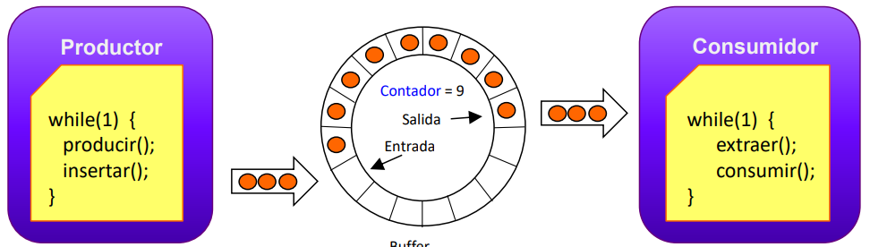

# Libreria pthread.h

// Para compilar: gcc -o Programacion_en_hilos Programacion_en_hilos.c -lpthread

Las subrutinas el cual comprende los Pthreads se dividen:

*   Administración de hilos: trabaja directamente sobre la creación, detaching (desconexión), joining (unión) y terminación de hilos.
*   Mutex (Mutual Exclusion): se encarga de la sincronización de los hilos. Estas funciones proveen de mecanismos para la creación, destrucción, bloqueo y desbloqueo de mutexes.

También son complementados por funciones de atributo de mutex que permiten la configuración de los atributos de los mutexes.
* Variables de condicion: son un tipo fino de sincronización basado sobre las condiciones especificas del programador. Estas funciones proveen de mecanismos para la creación, destrucción, espera y señalización de variables de condición.

## Creación de hilos

```c
#include <pthread.h>
int pthread_create(pthread_t *thread, 
                     const pthread_attr_t *attr, 
                     void *(*start_routine) (void *), 
                     void *arg);
```
*   Crea inmediatamente un nuevo hilo en estado `preparado`, por lo que el hilo puede ser ejecutado en cualquier momento. 
*   Puede ser invocada por cualquier hilo del proceso para crear un nuevo hilo. Es decir, un hilo puede crear un nuevo hilo, el cual a su vez puede crear otro hilo, y así sucesivamente.
*   Parametros:
    *   `thread`: identificador del hilo creado.
    *   `attr`: atributos del hilo. Si es `NULL`, se utilizan los atributos por defecto.
    *   `start_routine`: función que será ejecutada por el hilo.
    *   `arg`: argumento que será pasado a la función `start_routine`.
*  Retorna `0` si la creación del hilo fue exitosa, en caso contrario retorna un valor distinto de `0`.

## Terminación de hilos

```c
#include <pthread.h>
void pthread_exit(void *status);
```
*   Termina el hilo que invoca la función.
* `pthread_exit` finaliza explícitamente la ejecucion del hilo que la invoca. La finalización de un hilo también se hace cuando finaliza la ejecución de las instrucciones de su función.
*   `status`: valor de retorno del hilo. Este valor puede ser recuperado por otro hilo mediante la función `pthread_join` a través del puntero `status`. Esto si el hilo es sincronizable.

## Identificación de hilos

```c
#include <pthread.h>
pthread_t pthread_self(void);
```
*   Retorna el identificador del hilo que invoca la función.

### Ejemplo

Este código crea dos hilos que imprimen un mensaje cada 2 y 3 segundos, respectivamente, mientras el hilo principal duerme por 30 segundos antes de terminar.    
```c
    #include <pthread.h> // Incluye la biblioteca para trabajar con hilos

// Función que se ejecutará periódicamente en un hilo
void * periodic (void *arg)
{
    int period; // Variable para almacenar el periodo
    period = *((int *)arg); // Convierte el argumento a un entero y lo asigna a 'period'
    while (1) { // Bucle infinito
        printf("En tarea con periodo %d\n", period); // Imprime el periodo actual
        sleep (period); // Duerme el hilo por el periodo especificado
    }
}

main() {
    pthread_t th1, th2; // Declaración de dos identificadores de hilos
    int period1, period2; // Variables para los periodos de los hilos
    period1 = 2; // Asigna el periodo 2 al primer hilo
    period2 = 3; // Asigna el periodo 3 al segundo hilo
    // Crea el primer hilo y verifica si hubo un error
    if (pthread_create(&th1, NULL, periodic, &period1) == -1) {
        perror(""); // Imprime el error si la creación del hilo falla
    }
    // Crea el segundo hilo y verifica si hubo un error
    if (pthread_create(&th2, NULL, periodic, &period2) == -1) {
        perror(""); // Imprime el error si la creación del hilo falla
    }
    sleep(30); // Duerme el hilo principal por 30 segundos
    printf("Salida del hilo principal\n"); // Imprime un mensaje indicando la salida del hilo principal
    exit(0); // Termina el programa
}

```

##  Atributos de los hilos
| Función | Descripción |
| --- | --- |
|`pthread_attr_init(pthread_attr_t *attr)` | Inicializa el objeto de atributos de hilo `attr` y establece los valores por defecto. |
|`pthread_attr_destroy(pthread_attr_t *attr)` | Destruye el objeto de atributos de hilo `attr` y libera los recursos asociados con él. |
|`pthread_attr_getstacksize(const pthread_attr_t *attr, size_t *stacksize)` | Obtiene el tamaño de la pila de un objeto de atributos de hilo. |
|`pthread_attr_setstacksize(pthread_attr_t *attr, size_t stacksize)` | Establece el tamaño de la pila de un objeto de atributos de hilo. |
|`pthread_attr_getstackaddr(const pthread_attr_t *attr, void **stackaddr)` | Obtiene la dirección base de la pila de un objeto de atributos de hilo. |
|`pthread_attr_setstackaddr(pthread_attr_t *attr, void *stackaddr)` | Establece la dirección base de la pila de un objeto de atributos de hilo. |
|`pthread_attr_getdetachstate(const pthread_attr_t *attr, void *detachstate)`  | Obtiene el estado `detach` desconexión de un objeto de atributos de hilo. Un thread `detached` (desconectado) no necesita ser `joined` (unido) por otro thread. |
|`pthread_attr_setdetachstate(pthread_attr_t *attr, void *detachstate)` | Establece el estado de desconexión de un objeto de atributos de hilo. |
|`pthread_attr_getscope(const pthread_attr_t *attr, int **contention_scope)` | Obtiene el alcance de un objeto de atributos de hilo. |
|`pthread_attr_setscope(pthread_attr_t *attr, int *contention_scope)` | Establece el alcance de un objeto de atributos de hilo. |
|`pthread_attr_getschedpolicy(const pthread_attr_t *attr, int *policy)` | Obtiene la política de planificación de un objeto de atributos de hilo. |
|`pthread_attr_setschedpolicy(pthread_attr_t *attr, int policy)` | Establece la política de planificación de un objeto de atributos de hilo. |


```c
#include <pthread.h>
int pthread_attr_init(pthread_attr_t *attr);
int pthread_attr_destroy(pthread_attr_t *attr);
```
*   `pthread_attr_init/destroy`: manipulan los atributos de los hilos.
*   `pthread_attr_init`: inicializa el objeto de atributos de hilo `attr` y establece los valores por defecto. Posteriormente, este objeto, con atributos por defecto, se puede utilizar para crear multiples hilos. 
    * El uso de `pthread_attr_init` es crucial para configurar los atributos de un hilo antes de su creación. Al inicializar el objeto de atributos, se asegura que todos los valores estén en su estado predeterminado, lo que facilita la creación de hilos con configuraciones estándar. Esto es especialmente útil cuando se necesita crear varios hilos con las mismas características, ya que se puede reutilizar el mismo objeto de atributos. 
*   `pthread_attr_destroy`: destruye el objeto de atributos de hilo `attr` y libera los recursos asociados con él. Este no puede volver a utilizarse hasta que se vuelva a inicializar con `pthread_attr_init`.

### Atributos de los hilos
*   `detachstate`: Controla si otro hilo podrá esperar por la terminación de este hilo (mediante la invocación de `pthread_join`):
    *   `PTHREAD_CREATE_JOINABLE`: El hilo puede ser esperado por otro hilo.
    *   `PTHREAD_CREATE_DETACHED`: El hilo no puede ser esperado por otro hilo.
    *   Ejemplo de uso:
        ```c
        pthread_t thread;
        pthread_attr_t attr;
        pthread_attr_init(&attr);

        // Para crear un hilo joinable
        pthread_attr_setdetachstate(&attr, PTHREAD_CREATE_JOINABLE);
        pthread_create(&thread, &attr, thread_function, NULL);
        pthread_join(thread, NULL);

        // Para crear un hilo detached
        pthread_attr_setdetachstate(&attr, PTHREAD_CREATE_DETACHED);
        pthread_create(&thread, &attr, thread_function, NULL);

        pthread_attr_destroy(&attr);
        ```

    *   Consideraciones:
        *   Los hilos joinable deben ser esperados por otro hilo para liberar sus recursos.
        *   Los hilos detached liberan sus recursos automáticamente al finalizar.
*   `schedpolicy`: Controla la política de planificación del hilo:
    *   `SCHED_FIFO`: Planificación FIFO. (First In First Out + tiempo real + privilegios root)
    *   `SCHED_RR`: Planificación Round Robin. 
    *   `SCHED_OTHER`: Planificación por defecto.
    *   Ejemplo de uso:
        ```c
        pthread_t thread;
        pthread_attr_t attr;
        pthread_attr_init(&attr);

        // Para crear un hilo con política FIFO
        pthread_attr_setschedpolicy(&attr, SCHED_FIFO);
        pthread_create(&thread, &attr, thread_function, NULL);

        // Para crear un hilo con política Round Robin
        pthread_attr_setschedpolicy(&attr, SCHED_RR);
        pthread_create(&thread, &attr, thread_function, NULL);

        // Para crear un hilo con política por defecto
        pthread_attr_setschedpolicy(&attr, SCHED_OTHER);
        pthread_create(&thread, &attr, thread_function, NULL);

        pthread_attr_destroy(&attr);
        ```

    *   Consideraciones:
        *   La política de planificación FIFO asigna la CPU al hilo hasta que este termine o se bloquee.
        *   La política de planificación Round Robin asigna la CPU al hilo por un tiempo limitado.
        *   La política de planificación por defecto depende de la implementación del sistema operativo.
* `scope`: Controla el alcance de la planificación del hilo:
    *   `PTHREAD_SCOPE_SYSTEM`: El hilo es planificado por el sistema operativo.
    *   `PTHREAD_SCOPE_PROCESS`: El hilo es planificado por el proceso.
    *   Ejemplo de uso:
        ```c
        pthread_t thread;
        pthread_attr_t attr;
        pthread_attr_init(&attr);

        // Para crear un hilo con alcance de sistema
        pthread_attr_setscope(&attr, PTHREAD_SCOPE_SYSTEM);
        pthread_create(&thread, &attr, thread_function, NULL);

        // Para crear un hilo con alcance de proceso
        pthread_attr_setscope(&attr, PTHREAD_SCOPE_PROCESS);
        pthread_create(&thread, &attr, thread_function, NULL);

        pthread_attr_destroy(&attr);
        ```

    *   Consideraciones:
        *   El alcance de sistema permite que el hilo sea planificado por el sistema operativo.
        *   El alcance de proceso permite que el hilo sea planificado por el proceso.
*  `stacksize`: Controla el tamaño de la pila del hilo:
    *   Ejemplo de uso:
        ```c
        pthread_t thread;
        pthread_attr_t attr;
        pthread_attr_init(&attr);

        // Para crear un hilo con tamaño de pila de 1 MB
        pthread_attr_setstacksize(&attr, 1024 * 1024);
        pthread_create(&thread, &attr, thread_function, NULL);

        pthread_attr_destroy(&attr);
        ```

    *   Consideraciones:
        *   El tamaño de la pila determina la cantidad de memoria que el hilo puede utilizar.
        *   Un tamaño de pila más grande permite que el hilo utilice más memoria, pero puede aumentar el uso de memoria del programa.
        *   Un tamaño de pila más pequeño puede reducir el uso de memoria del programa, pero puede causar errores de desbordamiento de pila.

## Espera por la terminación de un hilo

```c
#include <pthread.h>
int pthread_join(pthread_t thread, void **status);
```
*   Esta función suspende la ejecución del hilo que la invoca hasta que el hilo especificado por `thread` termine. Ya sea por la invocación de `pthread_exit` o por estar cancelado.
*   Si `status` no es `NULL`, el valor de retorno del hilo terminado se almacena en la dirección de memoria apuntada por `status`.
*   El valor devuelto es o bien el argumento de la función `pthread_exit` o el valor `PTHREAD_CANCELED` si el hilo `tid` fue cancelado. `tid` es el identificador del hilo que terminó.
*   El hilo por el cual se espera debe ser `joinable`. Si el hilo es `detached`, la función `pthread_join` fallará.
    *   Cuando un hilo en estado `joinable` termina, el sistema operativo mantiene su estado hasta que otro hilo lo espera mediante `pthread_join`. En este punto, el hilo terminado es eliminado y sus recursos son liberados.
    *   La espera por la terminación de un hilo para el cual ya hay un hilo esperando, resultará en un error. Debido a que un hilo solo puede ser esperado una vez.

### Ejemplo 


Este programa en C crea tres hilos utilizando la biblioteca pthread, donde cada hilo ejecuta una función que simula un trabajo computacional intensivo mediante sumas de números aleatorios. Los hilos se crean en el hilo principal, ejecutan su tarea en paralelo y, una vez completado el trabajo, imprimen el resultado en la consola. El programa luego espera a que todos los hilos terminen su ejecución antes de finalizar, asegurando la correcta sincronización mediante el uso de `pthread_join()`.

```c
#include <pthread.h>
#include <stdio.h>

#define NUM_THREADS 3 // Define el número de hilos a crear

// Función que ejecutará cada hilo
void *BusyWork(void *null) {
    int i;
    double result = 0.0;

    // Realiza una operación de trabajo "pesado"
    for (i = 0; i < 1000000; i++) {
        result = result + (double)random();
    }

    // Imprime el resultado de la operación
    printf("result = %lf\n", result);

    // Termina el hilo
    pthread_exit((void *) 0);
}

void main() {
    pthread_t thread[NUM_THREADS]; // Array para almacenar los identificadores de los hilos
    pthread_attr_t attr; // Atributos de los hilos
    int rc, t, status;

    // Inicializa y configura los atributos del hilo
    pthread_attr_init(&attr);
    pthread_attr_setdetachstate(&attr, PTHREAD_CREATE_UNDETACHED);

    // Crea los hilos
    for (t = 0; t < NUM_THREADS; t++) {
        printf("Creating thread %d\n", t);
        pthread_create(&thread[t], &attr, BusyWork, NULL);
    }

    // Libera los atributos del hilo y espera a que los hilos terminen
    pthread_attr_destroy(&attr);
    for (t = 0; t < NUM_THREADS; t++) {
        pthread_join(thread[t], (void **)&status);
        printf("Completed join with thread %d status= %d\n", t, status);
    }

    // Termina el hilo principal
    pthread_exit(NULL);
}
```

##  Cancelación de hilos

```c	
#include <pthread.h>
int pthread_cancel(pthread_t thread);
```
*   Esta función cancela el hilo especificado por `thread`.
*   Dependiendo de la configuración del hilo, la cancelación puede ser asíncrona o diferida. Puede aceptar peticiones de cancelación (`PTHREAD_CANCEL_ENABLE`) o ignorarlas (`PTHREAD_CANCEL_DISABLE`).
    *   La cancelación asíncrona interrumpe inmediatamente la ejecución del hilo.(`PTHREAD_CANCEL_ASYNCHRONOUS`)
    *   La cancelación diferida permite al hilo continuar ejecutándose hasta que alcance un punto de cancelación. Un punto de cancelación es un lugar en el código donde el hilo verifica si ha sido cancelado y, si es así, realiza las acciones necesarias para finalizar su ejecución.(`PTHREAD_CANCEL_DEFERRED`)
*   Cuando un hilo acepta una petición de cancelación, el hilo actúa como si se hubiese llamado a `pthread_exit` con el valor `PTHREAD_CANCELED`.

## Comunicación entre tareas

-   Sincronización de hilos: problemática.
    *   Ejemplo: el problema del productor-consumidor.
        *   Un productor produce datos y los coloca en un buffer.
        *   Un consumidor consume los datos del buffer.
        *   El productor y el consumidor deben sincronizarse para evitar condiciones de carrera.
        *   Existe un buffer acotado (cola circular) que acomoda la diferencia de velocidad entre el productor y el consumidor.
        * Si el buffer está lleno, el productor debe esperar a que el consumidor consuma datos.
        * Si el buffer está vacío, el consumidor debe esperar a que el productor produzca datos.
    *   Soluciones:
        *   Semáforos.
        *   Variables de condición.
        *   Mutexes.
        *   Barreras.
        *   Monitores.
        *   Otros.
        
    

## Mutexes: 
*   Se utilizan para bloquear el acceso a una sección crítica de código que debe ser compartida por múltiples hilos.
* El mutex actúa como un ticket (token) que debe ser adquirido por un hilo antes de acceder a la sección crítica. Si otro hilo ya tiene el mutex, el hilo que intenta adquirirlo se bloquea hasta que el mutex esté disponible.
*   Una vez que una tarea adquiere el mutex, se convierte en el propietario del mutex y puede acceder a la sección crítica. Cuando la tarea termina de usar la sección crítica, libera el mutex para que otros hilos puedan adquirirlo.
*   Existen algunos problemas de sincronización que se deben evitar al utilizar mutexes:
    *   Deadlock: ocurre cuando dos o más hilos se bloquean mutuamente al esperar por un recurso que el otro hilo posee.
    *   Starvation: ocurre cuando un hilo no puede adquirir un recurso compartido debido a la prioridad de otros hilos.
    *   Livelock: ocurre cuando dos o más hilos se bloquean mutuamente al intentar evitar un deadlock.
    *   Inverión de prioridades: ocurre cuando un hilo de baja prioridad bloquea un recurso que necesita un hilo de alta prioridad.
* Hay dos mecanismos que permiten sincronizar hilos:
    *   Mutexes: permiten a los hilos bloquear y desbloquear secciones críticas de código. Es una variable que proporciona exclusión mutua mediante dos operaciones, `lock` y `unlock`.
    *   Variables de condición: permiten a los hilos esperar a que se cumpla una condición antes de continuar, mediante las operaciones `wait`, `signal` y `broadcast`.
    
    | Función | Descripción |
    | --- | --- |
    |`pthread_mutex_init(pthread_mutex_t *mutex, const pthread_mutexattr_t *attr)` | Inicializa un objeto de mutex con los atributos especificados. |
    |`pthread_mutex_destroy(pthread_mutex_t *mutex)` | Destruye un objeto de mutex y libera los recursos asociados con él. |
    |`pthread_mutex_attr_init(pthread_mutexattr_t *attr)` | Inicializa un objeto de atributos de mutex y establece los valores por defecto. |
    |`pthread_mutex_attr_destroy(pthread_mutexattr_t *attr)` | Destruye un objeto de atributos de mutex y libera los recursos asociados con él. |
    |`pthread_mutex_lock(pthread_mutex_t *mutex)` | Bloquea un objeto de mutex. Si el mutex ya está bloqueado, el hilo se bloquea hasta que el mutex esté disponible. |
    |`pthread_mutex_trylock(pthread_mutex_t *mutex)` | Intenta bloquear un objeto de mutex. Si el mutex ya está bloqueado, la función falla y devuelve un error. |
    |`pthread_mutex_unlock(pthread_mutex_t *mutex)` | Desbloquea un objeto de mutex. |

    ### Ejemplo
    Este programa en C crea un buffer compartido entre un productor y un consumidor utilizando la biblioteca pthread. El productor escribe datos en el buffer, mientras que el consumidor lee los datos del buffer. Para sincronizar el acceso al buffer, se utiliza un mutex que bloquea el acceso a la sección crítica del código. El productor y el consumidor comparten el mutex para garantizar que solo un hilo pueda acceder al buffer a la vez.
    ```c
    #include <pthread.h>
    #include <stdio.h>
    
    // Define a buffer structure with a data array and a mutex for synchronization
    struct {
        int data[1];
        pthread_mutex_t mutex; 
    } buffer;
    
    int main(void) {
        pthread_t rd; 
        pthread_attr_t attr; 
        int valores[50], indice, in, c, x;
        void *status; 
        void *consumidor(void *); 
        void escritura(int); 
    
        // Initialize the mutex
        pthread_mutex_init(&buffer.mutex, NULL);
    
        // Initialize thread attributes
        pthread_attr_init(&attr);
        pthread_attr_setdetachstate(&attr, PTHREAD_CREATE_JOINABLE);
    
        // Create the consumer thread
        pthread_create(&rd, &attr, consumidor, NULL);
    
        // Fill the values array with data to be written and read
        for (indice = 0; indice < 15; indice++) {
            valores[indice] = indice;
        }
        valores[indice] = 50;
    
        // Producer thread (main)
        indice = 0;
        do {
            c = valores[indice++]; 
            escritura(c); 
        } while (c != 50);
    
        // Wait for the consumer thread to finish
        pthread_join(rd, &status);
    
        printf("fin del programa\n");
        exit(0);
    }
    
    // Consumer thread function
    void *consumidor(void *arg) {
        int c, yy;
        do {
            c = lectura(); 
        } while (c != 50);
        return NULL;
    }
    
    // Function to write data to the buffer
    void escritura(int c) {
        int xx;
        pthread_mutex_lock(&buffer.mutex); // Lock the mutex
        buffer.data[1] = c; // Insert data into the buffer
        pthread_mutex_unlock(&buffer.mutex); // Unlock the mutex
    }
    
    // Function to read data from the buffer
    int lectura() {
        int elem, c; 
        pthread_mutex_lock(&buffer.mutex); // Lock the mutex
        elem = buffer.data[1]; // Read data from the buffer
        c = elem; 
        printf("%3d", c); 
        pthread_mutex_unlock(&buffer.mutex); // Unlock the mutex
        return elem;
    }
    ```
## Variables de condición
*   Proveen otra manera de sincronizar hilos. Mientras que los mutexes permiten a los hilos bloquear y desbloquear secciones críticas de código, las variables de condición permiten sincronizar hilos en base al valor actual de una variable.
*   Sin variables de condición, se podría tener hilos que continuamente estén verificando si una condición se cumple, lo que resulta en un uso ineficiente de la CPU. Polling (sondeo) es el término que describe esta situación.

| Función | Descripción |
| --- | --- |
|`pthread_cond_init(pthread_cond_t *cond, const pthread_condattr_t *attr)` | Inicializa un objeto de variable de condición con los atributos especificados. |
|`pthread_cond_destroy(pthread_cond_t *cond)` | Destruye un objeto de variable de condición y libera los recursos asociados con él. |
|`pthread_condattr_init(pthread_condattr_t *attr)` | Inicializa un objeto de atributos de variable de condición y establece los valores por defecto. |
|`pthread_condattr_destroy(pthread_condattr_t *attr)` | Destruye un objeto de atributos de variable de condición y libera los recursos asociados con él. |
|`pthread_cond_wait(pthread_cond_t *cond, pthread_mutex_t *mutex)` | Espera a que se cumpla una condición. Libera el mutex y se bloquea hasta que se recibe una señal. |
|`pthread_cond_signal(pthread_cond_t *cond)` | Señaliza a un hilo que está esperando en una variable de condición. |
### Ejemplo
El código implementa un programa en C que utiliza hilos para simular un productor y un consumidor que comparten un buffer. El productor (hilo principal) escribe datos en el buffer, mientras que el consumidor (hilo secundario) lee datos del buffer. Se utilizan un mutex y una variable de condición para sincronizar el acceso al buffer, asegurando que el productor no escriba cuando el buffer está lleno y que el consumidor no lea cuando el buffer está vacío.

```c
#include <pthread.h>
#include <stdio.h>

// Estructura del buffer compartido
struct {
    int data[1]; // Buffer compartido
    pthread_mutex_t mutex; // Mutex para sincronización
    pthread_cond_t cond; // Variable de condición para sincronización
} buffer;

int nnElem = 0; // Indica si el buffer está lleno (1) o vacío (0)

int main(void) {
    pthread_t rd; // ID del hilo consumidor
    pthread_attr_t attr; // Atributos del hilo
    int valores[50], indice, c, x;
    void *status; // Estado de salida del hilo
    void *consumidor(void *); // Prototipo de la función del consumidor
    void write_to_buffer(int); // Prototipo de la función para escribir en el buffer
    indice = 0;

    // Inicializa el mutex
    pthread_mutex_init(&buffer.mutex, NULL);
    // Inicializa la variable de condición
    pthread_cond_init(&buffer.cond, NULL);
    // Inicializa los atributos del hilo
    pthread_attr_init(&attr);
    pthread_attr_setdetachstate(&attr, PTHREAD_CREATE_JOINABLE);
    // Crea el hilo consumidor
    pthread_create(&rd, &attr, consumidor, NULL);

    // Inicializa los valores a escribir en el buffer
    for (indice = 0; indice < 15; indice++) {
        valores[indice] = indice;
    }
    valores[indice] = 50;

    // Hilo productor (main)
    indice = 0;
    do {
        c = valores[indice++];
        write_to_buffer(c); // Escribe en el buffer
    } while (c != 50);

    // Espera a que el hilo consumidor termine
    pthread_join(rd, &status);
    printf("Fin de Programa\n");
}

// Función del hilo consumidor
void *consumidor(void *arg) {
    int c;
    int read_from_buffer(); // Prototipo de la función para leer del buffer
    do {
        c = read_from_buffer(); // Lee del buffer
    } while (c != 50);
}

// Función para escribir en el buffer
void write_to_buffer(int c) {
    pthread_mutex_lock(&buffer.mutex); // Bloquea el mutex
    if (nnElem == 1) // Si el buffer está lleno, espera
        pthread_cond_wait(&buffer.cond, &buffer.mutex);
    buffer.data[0] = c; // Inserta el dato en el buffer
    nnElem = nnElem + 1; // Incrementa para indicar que el buffer está lleno
    pthread_cond_signal(&buffer.cond); // Despierta al hilo consumidor
    pthread_mutex_unlock(&buffer.mutex); // Desbloquea el mutex
}

// Función para leer del buffer
int read_from_buffer() {
    int elem, c;
    pthread_mutex_lock(&buffer.mutex); // Bloquea el mutex
    if (nnElem == 0) // Si el buffer está vacío, espera
        pthread_cond_wait(&buffer.cond, &buffer.mutex);
    elem = buffer.data[0]; // Consume un dato del buffer
    nnElem = nnElem - 1; // Decrementa para indicar que el buffer está vacío
    pthread_cond_signal(&buffer.cond); // Despierta al hilo productor
    pthread_mutex_unlock(&buffer.mutex); // Desbloquea el mutex
    return elem;
}
```